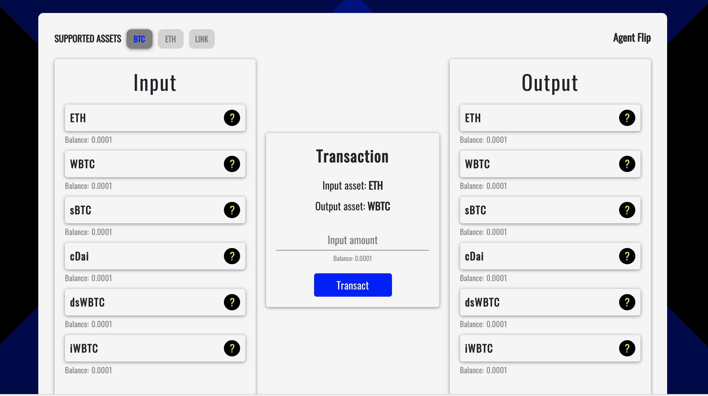

## Agent Flip

### Inspiration
Sophisticated investors have evolving needs. An investor might be long WBTC when his thesis changes and he wants to go short. An investor might be long sBTC when one of his LPs tells him their fund contract requires collateralized rather than synthetic crypto investments. An investor might be holding cDai, earning interest until he's ready to get back into WBTC at a moment's notice.

There are *many* possible permutations. But today, an investor would have to visit several UIs and touch several protocols in order to reposition themselves accordingly.

### What Agent Flip does
Agent Flip is a DeFi trading bridge between protocols. Our first supported asset is BTC. In one contract call, an investor can conveniently reposition, leveraging the power of five different trading protocols at once.

We use:

- Kyber
- Synthetix
- Uniswap
- Compound (WIP)
- bZx (WIP)

Our first supported asset is BTC/WBTC.

### Usage
- Choose an available input asset (you must have a balance in that asset)
- Choose an available output asset
- Input an amount less than your available input asset balance
- Flip!
- You may have to refresh the page to see updated balances

### Team
- Michael Cohen ([Github](http://github.com/michaelcohen716), [Twitter](http://twitter.com/mjayceee))
- Sudeep Biswas ([Github](http://github.com/sudeepb02), [Twitter](https://twitter.com/sudeepbiswas02))

### What's next for Agent Flip
- Finish remaining protocol integrations
- Refactor contract code to make platform more extensible
- Add supported assets

### Built With
- React
- Solidity
